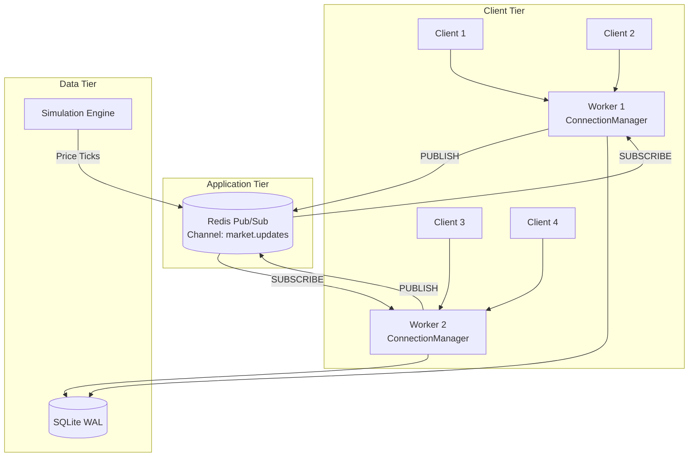
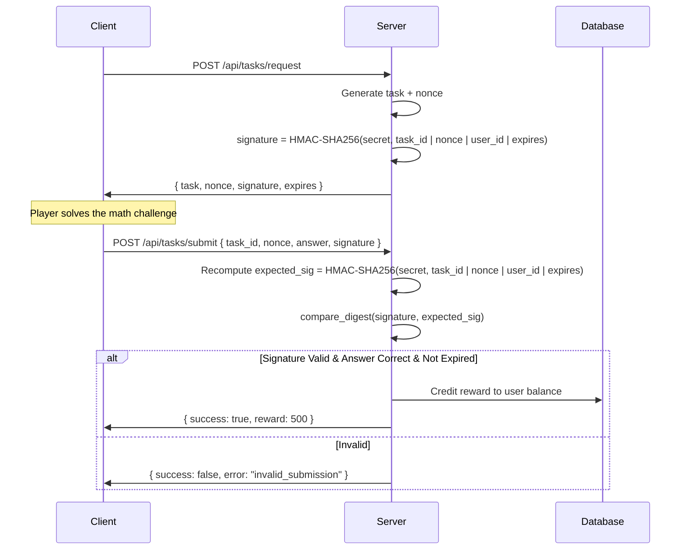

# Full-Scale Technical Architecture & Economic Blueprint
## Massively Multiplayer Virtual Stock Market

**Version:** 1.0  
**Classification:** Internal Engineering Reference  
**Stack:** HTML5 Canvas | Vanilla JS | CSS3 | Python (FastAPI) | SQLite | Redis | Nginx

---

## Table of Contents

1. [High-Performance Frontend & Visualization](#1-high-performance-frontend--visualization)
2. [Virtual Macroeconomics & Inflationary Controls](#2-virtual-macroeconomics--inflationary-controls)
3. [The Mathematical Simulation Engine](#3-the-mathematical-simulation-engine)
4. [Database Architecture & Transaction Integrity](#4-database-architecture--transaction-integrity)
5. [Asynchronous WebSocket Infrastructure](#5-asynchronous-websocket-infrastructure)
6. [Cryptographic Task Verification & Anti-Cheat](#6-cryptographic-task-verification--anti-cheat)
7. [Edge Node Deployment & Reverse Proxy Optimization](#7-edge-node-deployment--reverse-proxy-optimization)
8. [Four-Week Development Roadmap](#8-four-week-development-roadmap)

---

## 1. High-Performance Frontend & Visualization

### 1.1 The DOM Explosion Problem

Traditional SVG/DOM-based charting creates one DOM node per data point. At 1,000 ticks × 50 assets, the browser manages 50,000+ live nodes — triggering layout thrashing, forced reflows, and garbage collection stalls that push frame times above 33ms (below 30 FPS).

**Solution:** A single `<canvas>` element backed by a `CanvasRenderingContext2D`. All chart geometry is drawn imperatively per frame. The DOM contains exactly one node regardless of data volume.

### 1.2 Algorithmic Data Conflation (Level-of-Detail)

Raw tick data at full resolution is unnecessary when zoomed out. The renderer implements **temporal conflation** across zoom states:

| Zoom Level | Time Bucket | Data Points (1yr) | Conflation Method |
|---|---|---|---|
| `1D` (Intraday) | 1 second | ~23,400 | None (raw ticks) |
| `1W` (Weekly) | 5 minutes | ~2,016 | OHLC aggregation |
| `1M` (Monthly) | 1 hour | ~720 | OHLC aggregation |
| `1Y` (Yearly) | 1 day | ~252 | OHLC aggregation |
| `ALL` | 1 week | ~52/yr | OHLC aggregation |

**OHLC Aggregation:** For each bucket, retain only `Open` (first tick), `High` (max), `Low` (min), `Close` (last tick), and `Volume` (sum). This reduces draw calls by 95%+ at outer zoom levels.

### 1.3 GPU-Accelerated Glassmorphism

CSS glassmorphism panels (`backdrop-filter: blur()`) are composited on the CPU by default. We force GPU compositing:

```css
.glass-panel {
    background: rgba(15, 15, 35, 0.6);
    backdrop-filter: blur(12px) saturate(1.4);
    -webkit-backdrop-filter: blur(12px) saturate(1.4);
    border: 1px solid rgba(255, 255, 255, 0.08);
    border-radius: 16px;
    transform: translateZ(0);       /* Force GPU layer promotion */
    will-change: transform;         /* Hint compositor */
    contain: layout style paint;    /* Isolate reflows */
}
```

`transform: translateZ(0)` promotes the element to its own compositing layer, offloading blur convolution to the GPU. `contain: layout style paint` prevents child mutations from triggering ancestor reflows.

### 1.4 Design Pattern Comparison

| Pattern | Implementation | Render Cost | Scalability |
|---|---|---|---|
| SVG Path per Series | `<path d="M...">` DOM nodes | O(n) DOM mutations | Degrades >5K points |
| DOM Table Ticker | `<div>` per cell, CSS Grid | O(n) reflows | Degrades >500 rows |
| Canvas Immediate Mode | `ctx.beginPath()` per frame | O(n) draw calls, 0 DOM | Linear to 500K+ points |
| WebGL (Future) | Vertex buffers, GLSL shaders | O(1) GPU dispatch | Millions of points |

**Decision:** Canvas Immediate Mode for v1.0. WebGL reserved for future multi-asset correlation heatmaps.

---

## 2. Virtual Macroeconomics & Inflationary Controls

### 2.1 The Hyperinflation Problem in Virtual Economies

Enclosed virtual economies with passive income (login rewards, idle generation) invariably undergo hyperinflationary collapse. Currency supply grows linearly or exponentially while the goods/asset pool remains bounded. This devalues the currency, trivializes progression, and destroys competitive integrity.

**Axiom:** No passive faucets. Zero currency enters the system without verified player labor.

### 2.2 Active Faucets — Proof-of-Work Bounties

Currency enters the economy exclusively through **Proof-of-Work (PoW) math bounties** — server-generated computational challenges that players must solve:

| Difficulty Tier | Challenge Type | Reward (¤) | Cooldown | Anti-Bot |
|---|---|---|---|---|
| Tier 1 (Easy) | Arithmetic (e.g., 347 × 28) | 50–100 | 30s | HMAC nonce |
| Tier 2 (Medium) | Algebra (e.g., solve 3x + 7 = 22) | 200–500 | 60s | HMAC + time-lock |
| Tier 3 (Hard) | Calculus/Statistics | 1,000–2,500 | 300s | HMAC + multi-step |

Each bounty is cryptographically signed server-side (HMAC-SHA256). The client cannot forge rewards. See Section 6.

### 2.3 Progressive Transaction Sinks

Every currency movement is taxed via a **progressive percentage-based sink**:

| Transaction Type | Sink Rate | Rationale |
|---|---|---|
| Market Buy | 0.5% | Friction on asset acquisition |
| Market Sell | 0.5% | Friction on liquidation |
| Limit Order (Fill) | 0.3% | Lower rate incentivizes limit orders |
| Player-to-Player Transfer | 2.0% | Discourages off-market dealing |
| Portfolio Withdrawal | 1.0% | Penalizes idle hoarding |

**Sink Coverage Ratio (SCR):**

$$SCR = \frac{\sum \text{Currency Destroyed (sinks)}}{\sum \text{Currency Created (faucets)}}$$

**Target:** SCR ≥ 0.95. The system monitors this ratio in real-time. If SCR drops below 0.90, sink rates automatically increase by 0.1% increments until equilibrium is restored.

### 2.4 Monetary Supply Equation

$$M_t = M_{t-1} + F_t - S_t$$

Where:
- $M_t$ = Total money supply at time $t$
- $F_t$ = Total faucet output (PoW rewards) at time $t$
- $S_t$ = Total sink drainage (taxes) at time $t$

The system enforces $F_t - S_t \approx 0$ at steady state.

---

## 3. The Mathematical Simulation Engine

### 3.1 Geometric Brownian Motion (GBM)

Asset prices are simulated using GBM, the standard stochastic model for equity prices:

$$dS_t = \mu S_t \, dt + \sigma S_t \, dW_t$$

Where:
- $S_t$ = Asset price at time $t$
- $\mu$ = Drift coefficient (expected return, annualized)
- $\sigma$ = Volatility coefficient (annualized standard deviation)
- $W_t$ = Standard Wiener process (Brownian motion)

### 3.2 Euler-Maruyama Discretization

The continuous SDE is discretized for numerical simulation:

$$S_{t+\Delta t} = S_t \exp\left[\left(\mu - \frac{\sigma^2}{2}\right)\Delta t + \sigma \sqrt{\Delta t} \, Z\right]$$

Where $Z \sim \mathcal{N}(0, 1)$ is a standard normal random variable.

This is the **exact solution** (log-normal), not an Euler approximation, ensuring no discretization drift.

### 3.3 Python Implementation

```python
def simulate_gbm(
    s0: float,
    mu: float,
    sigma: float,
    dt: float,
    n_steps: int,
    seed: int | None = None
) -> np.ndarray:
    rng = np.random.default_rng(seed)
    z = rng.standard_normal(n_steps)
    drift = (mu - 0.5 * sigma**2) * dt
    diffusion = sigma * np.sqrt(dt) * z
    log_returns = drift + diffusion
    log_prices = np.concatenate([[np.log(s0)], log_returns])
    return np.exp(np.cumsum(log_prices))
```

### 3.4 News Event Engine (Fat-Tail Shocks)

Real markets exhibit fat tails (kurtosis > 3). The news engine injects regime shifts:

```json
{
    "event_id": "fed_rate_hike",
    "name": "Federal Reserve Rate Hike",
    "probability": 0.02,
    "affected_sectors": ["banking", "real_estate"],
    "drift_modifier": -0.15,
    "volatility_modifier": 2.5,
    "duration_ticks": 50,
    "decay": "exponential"
}
```

When triggered, the event multiplies $\sigma$ by `volatility_modifier` and shifts $\mu$ by `drift_modifier`, decaying exponentially over `duration_ticks`.

---

## 4. Database Architecture & Transaction Integrity

### 4.1 SQLite WAL Configuration

SQLite's default rollback journal serializes all writes. **Write-Ahead Logging (WAL)** enables concurrent readers during writes:

```sql
PRAGMA journal_mode = WAL;
PRAGMA busy_timeout = 5000;
PRAGMA synchronous = NORMAL;
PRAGMA cache_size = -64000;   -- 64MB cache
PRAGMA foreign_keys = ON;
PRAGMA wal_autocheckpoint = 1000;
```

WAL allows unlimited concurrent reads. Writes are serialized but do not block readers.

### 4.2 Schema Design — Ledger/Relational Separation

**Principle:** Separate high-mutation ledger tables (transactions, orders) from low-mutation relational tables (users, assets) to minimize write contention.

**Relational Tables (Low Mutation):**
- `users` — Player accounts, credentials, balances
- `assets` — Stock definitions, sectors, base parameters
- `asset_prices` — Historical OHLC price snapshots

**Ledger Tables (High Mutation):**
- `orders` — Active limit/market orders (frequent INSERT/DELETE)
- `transactions` — Immutable append-only trade log
- `ledger_entries` — Double-entry bookkeeping for all currency flow

### 4.3 ACID Compliance

All balance-affecting operations execute within explicit transaction blocks:

```sql
BEGIN IMMEDIATE;
    -- Debit buyer
    UPDATE users SET balance = balance - :total WHERE id = :buyer_id AND balance >= :total;
    -- Credit seller
    UPDATE users SET balance = balance + :net WHERE id = :seller_id;
    -- Record transaction
    INSERT INTO transactions (buyer_id, seller_id, asset_id, quantity, price, tax) ...;
    -- Transfer asset ownership
    UPDATE portfolios SET quantity = quantity - :qty WHERE user_id = :seller_id AND asset_id = :asset_id;
    INSERT OR REPLACE INTO portfolios ...;
COMMIT;
```

`BEGIN IMMEDIATE` acquires a write lock upfront, preventing deadlocks from lock escalation.

---

## 5. Asynchronous WebSocket Infrastructure

### 5.1 FastAPI ConnectionManager

The `ConnectionManager` maintains a registry of active WebSocket connections, supports room-based broadcasting (per-asset subscriptions), and handles graceful disconnection:

- **Connection registry:** `dict[str, WebSocket]` keyed by user ID
- **Room subscriptions:** `dict[str, set[str]]` mapping asset symbols to subscriber user IDs
- **Broadcast:** Iterate room subscribers and `await ws.send_json()` concurrently via `asyncio.gather()`

### 5.2 Horizontal Scaling via Redis Pub/Sub

A single FastAPI worker's `ConnectionManager` only knows its own connections. For multi-worker deployment, **Redis Pub/Sub** bridges messages across workers:



**Flow:** Simulation engine publishes price ticks to Redis. All workers subscribe. Each worker broadcasts only to its local connections.

### 5.3 Message Protocol

All WebSocket messages use a typed envelope:

```json
{
    "type": "price_update | order_fill | balance_change | news_event",
    "timestamp": 1700000000.123,
    "payload": { }
}
```

---

## 6. Cryptographic Task Verification & Anti-Cheat

### 6.1 Threat Model

**Assumption:** The client environment is fully compromised. All client-side code is readable, modifiable, and replayable. Therefore:

- No game logic executes client-side with authority
- All rewards are validated server-side before crediting
- All submissions are bound to a specific user, task, and time window

### 6.2 HMAC-SHA256 Verification Flow



### 6.3 Security Properties

| Property | Mechanism |
|---|---|
| Forgery resistance | HMAC-SHA256 with server-only secret key |
| Replay resistance | Single-use nonce + expiration timestamp |
| Timing attack resistance | `hmac.compare_digest()` constant-time comparison |
| User binding | `user_id` embedded in signature payload |

---

## 7. Edge Node Deployment & Reverse Proxy Optimization

### 7.1 Nginx WebSocket Upgrade

RFC 6455 requires an HTTP/1.1 `Upgrade` handshake. Nginx must explicitly pass these headers:

```nginx
location /ws {
    proxy_pass http://backend;
    proxy_http_version 1.1;
    proxy_set_header Upgrade $http_upgrade;
    proxy_set_header Connection "upgrade";
    proxy_set_header Host $host;
    proxy_set_header X-Real-IP $remote_addr;
    proxy_set_header X-Forwarded-For $proxy_add_x_forwarded_for;
    proxy_set_header X-Forwarded-Proto $scheme;

    proxy_read_timeout 86400s;
    proxy_send_timeout 86400s;
}
```

### 7.2 Timeout & Heartbeat Protocol

- `proxy_read_timeout: 86400s` (24 hours) — prevents Nginx from closing idle WebSocket connections
- **Application-level heartbeat:** Server sends `{"type": "ping"}` every 30 seconds. Client responds with `{"type": "pong"}`. If 3 consecutive pongs are missed (90s), the server closes the connection and frees resources.
- **Reconnection:** Client implements exponential backoff: 1s, 2s, 4s, 8s, max 30s

### 7.3 Static Asset Serving

```nginx
location /static {
    alias /var/www/stock/frontend;
    expires 30d;
    add_header Cache-Control "public, immutable";
    gzip on;
    gzip_types text/css application/javascript;
}
```

---

## 8. Four-Week Development Roadmap

### Sprint Plan

| Week | Focus | Deliverables | Exit Criteria |
|---|---|---|---|
| **Week 1** | Data Layer | SQLite schema, WAL config, Pydantic models, CRUD operations, seed data | All tables created, 10K test transactions inserted, WAL verified |
| **Week 2** | Math Engine | GBM simulator, news event engine, economics module (faucets/sinks), back-test harness | 1-year simulation runs in <1s, SCR stays within 0.90–1.05 |
| **Week 3** | Real-Time Streams | WebSocket manager, Redis pub/sub bridge, REST API routes, HMAC anti-cheat | 100 concurrent WS connections, <50ms broadcast latency, zero forged rewards |
| **Week 4** | Frontend & Deploy | Canvas renderer, glassmorphism UI, Nginx config, load testing, security audit | 60 FPS at 10K data points, full E2E trading flow, deployed behind Nginx |

### Daily Cadence

- **Standup (async):** What shipped, what's blocked
- **EOD:** All code committed, tests green
- **Friday:** Integration test of all completed modules together

---

## Appendix A: Technology Justification

| Choice | Rationale | Trade-off |
|---|---|---|
| SQLite over PostgreSQL | Zero-ops, single-file deployment, WAL handles read concurrency | Single-writer bottleneck at extreme scale (>10K writes/sec) |
| FastAPI over Django | Native async/await, WebSocket first-class, Pydantic integration | Less batteries-included (no admin panel, ORM) |
| Redis Pub/Sub over Kafka | Sub-millisecond latency, minimal ops overhead | No message persistence, no replay |
| Canvas over WebGL | Simpler API, sufficient for 2D charting, wider browser support | No hardware-accelerated 3D or complex shaders |
| Vanilla JS over React | Zero bundle overhead, full control over render loop, no vDOM diffing cost | Manual state management, no component ecosystem |
